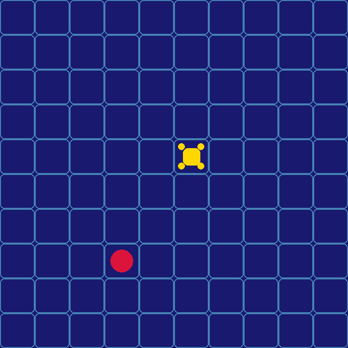

# Epilepsy Detection and Care System Using Reinforcement Learning and Computer Vision

## Project Overview

This project implements an epilepsy detection and patient monitoring system using reinforcement learning (RL) and computer vision techniques. It simulates a drone agent that monitors a patient within a 10x10 grid to detect seizure episodes promptly.


## Links 
- [Report](https://docs.google.com/document/d/1ReKnbrfWtzkNsy6_CEHfzIwjsgU0epBEq-TPCD2gVEY/edit?usp=sharing)
- [Video-Simulation](https://www.loom.com/share/71e4f8edb4564da883019863832782cf?sid=5960a7a4-cc61-4be6-b02a-5ddd107b6a41)


Two reinforcement learning methods are trained and compared:

- **Deep Q-Network (DQN)** – A value-based approach.
- **Proximal Policy Optimization (PPO)** – A policy gradient approach.

Both methods utilize the same custom environment to allow for fair and clear comparisons.

---

## Environment Description

- **Grid Size:** 10x10 cells.
- **Drone (Agent):** Moves horizontally and vertically above the grid.
- **Patient:** Randomly moves within the grid and periodically experiences seizures.
- **Seizure Events:** Randomly triggered events requiring prompt detection by the agent.

---

## Project Structure

```bash
project_root/
├── environment/
│   ├── custom_env.py            # Custom Gymnasium environment
│   └── rendering.py             # Visualization using PyOpenGL and pygame
├── training/
│   ├── dqn_training.py          # Training script for DQN agent
│   └── pg_training.py           # Training script for PPO agent
├── models/
│   ├── dqn/                     # Directory for DQN models
│   └── pg/                      # Directory for PPO models
├── main.py                      # Evaluate models and record videos
├── requirements.txt             # Python dependencies
└── README.md                    # Project documentation
```


---

## Step-by-Step Summary and Findings

### Step 1 - Installation
- Set up the environment and installed required packages for RL and visualization.

### Step 2 - Training Models
- **DQN**:
  - Learning rate: `0.0001`, Gamma: `0.95/0.98`, Replay buffer: `10000/10000`, Batch size: `32`
  - Explored effectively but slower convergence.
- **PPO**:
  - Learning rate: `0.0003/0.0001`, Gamma: `0.95/98`, Steps per update (n-steps): `2048/4096`
  - Faster convergence and stable reward improvement.

### Step 3 - Evaluating and Recording Videos
- Videos demonstrated PPO had smoother and quicker seizure detection compared to DQN.
-Link to vidoe above

### Step 4 - Visualization
- run the rendering.py fie to view
- Created a high and intuitive 2D-style visualizations showing clear interactions between drone and patient.


---

## Performance Metrics and Hyperparameter Impact
- PPO converged faster and consistently achieved higher rewards compared to DQN.
- Hyperparameters (especially learning rate and gamma) significantly impacted convergence speed and reward stability. Lower learning rates improved stability, while gamma (`0.98`) effectively balanced immediate and future rewards.

---

## Results & Comparison
- **DQN** showed good exploration but slower convergence and occasional instability.
- **PPO** consistently performed better, showing stability and quick learning.

---

## Conclusion
PPO outperformed DQN due to better handling of exploration-exploitation trade-off and effective hyperparameter settings. Adjusting hyperparameters (learning rate, gamma) significantly influenced performance, suggesting careful tuning is critical.

---

## Future Improvements
- Real-time data integration
- Advanced drone physics simulation
- Additional RL algorithms exploration

## Author
- This project belongs solely to Isaiah Essien